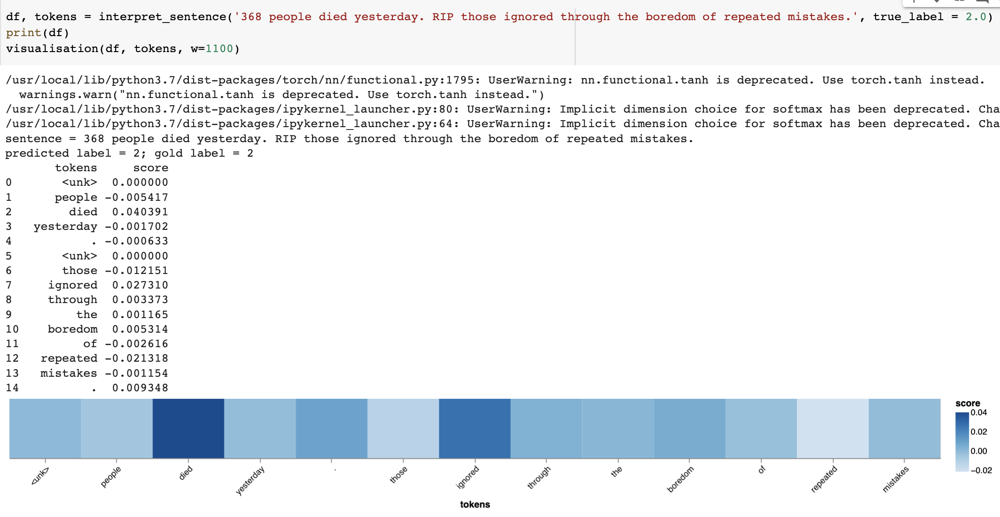
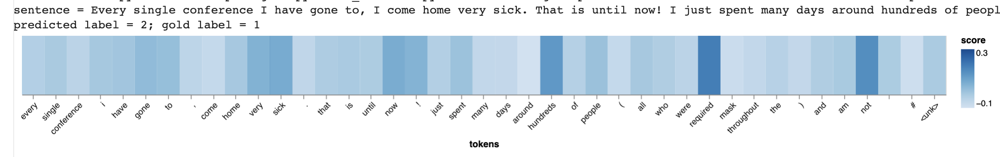
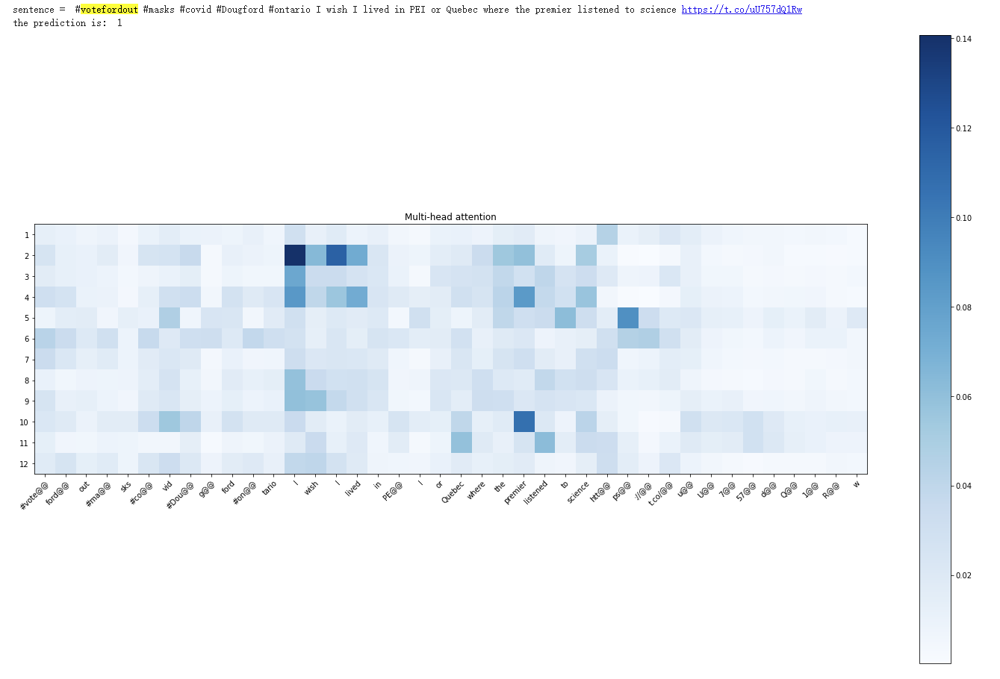

# Progress Report

### *Data:*

Our major training data is SemeVal2017 corpus, which includes more than 60,000 labeled tweets. The training part of it accounts for around 45,000 tweets. In order to fine-tune Bertweet, we are also using corpus with tweets with emojies and the training set includes about 50,000 tweets. 
On getting access to the full archive of Twitter, we ran a small study in order to understand the availability of the data. Originally, we were planning to study how the sentiment on masks and vaccines was changing between several countries batween several months. There were two options to do that: 1) sort out the tweets based on their geo-data(geo-tag) and 2)sort out the tweets based on the author's country of registration. As it turned out, although there are a lot of tweets with get-tags and from authors who specified their country, it did not work as expected. Once we set up the query, the number of tweets matching it and the number of tweets having any information about location was so scarce(around 10 tweets per country), that it appeared quite unfeasible to implement this country separation. Thus, it was decided to collect tweets posted in the English language based on the queries and based on the month they were posted. We also decided to filter out the tweets which are not fully connected to the discourse on masks and vaccines. What we mean by that is that we resolved to filter out the tweets that are ads and news headlines. This approach will enable us to see what common people are thinking about these topics and what sentiment they express in their tweets. In order to implement this approach, we created the following queries:

_Masks_ : (#covid OR #masks ) mask -is:retweet lang:en -sale -is:verified -is:nullcast -available -shop -#gaming -premium -#nft -#soft -#sale -#giveaway -#handmade -#fashion lang:en

_Vaccines_: (#covid OR #vaccine OR #CovidIsNotOver) covid vaccine -is:retweet lang:en -sale -is:verified -is:nullcast -available -shop -#gaming  -#nft  -#giveaway lang:en -#TedCruz -#submarines -discount -online -@YouTube -news -tracker -#china -#russia -#ukraine -watch -book -miramar -@GeorgiaOnline1 -#terrorism

The queries might look weird, but we were using Postman to check the results and what we wanted to achieve is to get the tweets which are fully connected to the specified topics and not the current or ongoing events. We might presume that we might lose some of information, but as it turned out, people keep on adding #covid tag basically to a lot of tweets which are not in any way even remotely connected to covid, let alone masks or vaccines. So, we decided to make this small sacrifice in order to 
get a cleaner and more clear-cut data. 
Although we use "-is:verified -is:nullcast" in our query, one more thing we had to add to enhance it is an additional API call to get the information about the tweets' authors. This information is used to filter out random ads accounts and accounts connected with news. In general, if we consider a real average Twitter user, we might presume they will not have more that 1,500 followers and they will not usually follow more than 1,500 other users, at the same time, these numbers are also usually more than 5(i.e. in most of the cases adds profiles do not have any followers), thus we also set the follower/following number to be higher than 5.

Now, that we have more information about the availability of data and what we want to learn from it, we can formulate our task more precisely: We would like to learn how the sentiment on such topics as masks and vaccines over the last months, namely from January, 2021 to March, 2022, was changing from month to month. On learning that there is not much data available even without countries filtering(there are no more than 15,000 tweets available for each month for masks), we are not going to limit the number of tweets for each month, but gather all the data available and analyze it. Here is the summary of what we have got after the initial collection and the second API call to filter on the authors:
 
MASKS: 
month / number of tweets  
2021-01    5650 
2021-04    5291 
2021-08    5248 
2021-03    5004 
2021-02    4398 
2021-07    4064 
2022-01    4009 
2021-05    3742 
2021-12    3386 
2022-02    3049 
2021-09    2775 
2022-03    2754 
2021-10    2130 
2021-11    2017 
2021-06    1908 
 
VACCINES: 
month / number of tweets  
2021-04    20018  
2021-01    18734  
2021-03    18391  
2021-05    17904  
2021-02    16793  
2021-08    15734  
2021-07    12074  
2021-09    11851  
2021-06    10215  
2021-12     9870  
2022-01     9712  
2021-10     9446  
2021-11     9359  
2022-02     4548  
2022-03     3931  

Both of our csv files have the following columns: 
-'author_id' 
-'created_at' 
-'tweet_id' 
-'tweet_text' 
-'CNN_prediction' 
-'CNN_confidence' 
-'BERTweet_prediction' 
-'BERTweet_confidence' 
-'BERTweet_fine-tuned_prediction' 
-'BERTweet_fine-tuned_confidence' 
-'final_prediction' 

We used Twitter API to fill it the first 4 of them. Now our plan is to take this data and pass it through our three trained models to gather the predictions. Since there is no way to have an to build an ensemble with analogous to the one offered by sklearn package in order to get the voting of the models and the information about their confidence, what we decided to do to ensure the accuracy of our predictions is to get the confidence from the models predictions, by added a softmax layer to the output of the models. This will provide us with some form of confidence, which we will use then to make the decision on the final prediction. What we are planning to do is to leave only those tweets on which predictions agree all of our three models. Moreover, we will also set an additional condition - all of the models should be at least 50% confident in their prediction. This approach will ensure that our predictions are more or less accurate.

Taking into account the fact that we have a completely different number of tweets for each topic for each month, our final results are going to be presented in percents, for example, we will report the percent of tweets being negative/positive or neutral for each month, and then create a plot for comparison for each topic between the months and then between the topics.

### *Engineering:*

As mentioned in milestone 2, our research and development is going to be centered around BERTweet model. However, since it does have some drawbacks, for example, it is not trained on emojies, we decided to address this problem and to train 3 separate models, namely, CNN(on SemeVal2017 corpus), BERTweet(on SemeVal2017 corpus) and BERTweet(on emoji corpus + fine-tuning on SemeVal2017 corpus).

Discussion:

**1) CNN + BiLSTM**

Since CNN + BiLSTM model with pre-trained embeddings yielded us the best results among all the CNN models that we tried last week, we trained CNN + BiLSTM on the full corpus and got the following results on the first run(around 9h to train the model): 
Validation accuracy - 0.59, Validation f-1 - 0.58 
 
In order to improve the scores, we also ran a random hyperparameter search in order to find the optimal values for hidden states, kernel sizes, dropout percent, learning rate and number of lstm layers, the search took about 24 hours and got stopped because the runtime terminated despite the fact that we were using Colab Pro and only 20% of our training data(around 9k tweets). Despite this early termination, we still managed to find out that the following values yield us some improved results: 
_{'num_layers': 1, 'kernel_sizes': [4, 5, 6], 'hidden_dim': 700, 'dropout': 0.7, 'lr': 0.001}_ 
 
What we achieved with that is: 
Validation accuracy - 0.66, Validation f-1 - 0.63 
 
On training our model on the full corpus with the above mentioned hyperparameters, we ended up with the following scores: 
Validation accuracy - 0.68, Validation f-1 - 0.66 
 
Therefore, we managed to boost the scores by almost 10%, which appears to be a nice result! 

Evaluation of our tuned model on the test set showed something interesting:
- Last week results: 
_vaccines_test.tsv_          0.68 acc, 0.70 f-1
_masks_test.tsv_             0.45 acc, 0.43 f-1
- This week results: 
_vaccines_test.tsv_          0.58 acc, 0.60 f-1
_masks_test.tsv_             0.63 acc, 0.65 f-1  
 
This looks unrealistic and we double-checked everything, but it looks like our model scores on the test sets went down, in particular, the drop is drastic on vaccines_test set, however, it increased massively on masks_test set, which looks very unusual. One thing to point out is that there is no large gap of 0.2 between two test sets anymore and that means that we managed to get our model generalize better.
 

We also tried to understand why the model makes this or that prediction, so we run a model interpretability study, let us consider some correct predictions: 
 
TWEET 1 - negative: '368 people died yesterday. RIP those ignored through the boredom of repeated mistakes.' 

The model correctly identifies 'died', 'ignored' and 'boredom' as words contributing to the negative sentiment, and it is equally correct in identifying 'people', 'those', 'of' and 'repeated' as words not really important for the tweet classification.

TWEET 2 - positive: "Went to the cinema for the first time in over two years last night. The cinema wanted Covid passes and mask wearing. Felt safe snd had a great time #MasksWork  #CovidIsNotOver"

On examining the last part of the tweet which makes it positive, we can see that the model correctly identifies all the words contributing to this sentiment - 'safe' and 'great' and ignores unrelated words - 'for', 'the', 'first', 'time' and so on. It is also interesting to see how it gives the importance initially to the word 'cinema', but the second word 'cinema' is, however, ignored.

TWEET 3 - neutral: "Do what you want. But, I personally believe we should still be wearing #masks in public settings. Especially very crowded indoor public areas. For the time being at least. Who's with me? #Ottawa #Ontario #MaskUp #WearAMask #MaskMandate #COVID19 #COVID #CovidIsNotOver #DougFord"

INCORRECT PREDICTIONS: 
 
TWEET 1(classified as positive, while it is neutral): "Good morning friends!  I have a question. No judgement, I promise.  Are you still wearing your mask when indoors shopping, or at the mall?  #Covid #Masks"

By mistake, the model gives a lot of importance to the exclamation mark and '.'

TWEET 2(classified as positive, while it is negative): "#votefordout #masks #covid #Dougford #ontario I wish I lived in PEI or Quebec where the premier listened to science https: //t.co/ uU757dQ1Rw"

TWEET 3(classified as negative, while it is positive): "Every single conference I have gone to, I come home very sick. That is until now! I just spent many days around hundreds of people (all who were required to mask throughout the conference) and I am not sick!  #MasksWork #RetreatMigraine2022 #ConferencesDoneRight @CoalitionCHAMP"

From the errors the model is making, we can see that it is not capable to read between the lines, it does not detect sarcasm or irony in TWEET 2 and it is also not capable to infer that the reason TWEET 3 is positive is because of the last part if it. 

**2) BERTweet(on SemeVal2017 corpus)**
- The pertained Betweet + untrained linear model is trained on Google Colab on GPU. The documentation of pertained Bertweet can be found [here](https://huggingface.co/docs/transformers/model_doc/bertweet). The code for data preparation and training process based off the [BERT tutorial](https://github.ubc.ca/mds-cl-2021-22/COLX_585_trends_students/blob/master/tutorials/BPE-BERT/bert_pytorch.ipynb). The code for training the Bertweet + linear layer model can be found [here](https://github.ubc.ca/maryisme/covid_sentiment/blob/master/milestone_3/Bertweet/Bertweet.ipynb).
- Test results:
test set: Test Loss: 0.7167, Test Accuracy: 0.7165, Test F1: 0.7164  
vaccine: Test Loss: 0.7535, Test Accuracy: 0.7426, Test F1: 0.7302  
masks: Test Loss: 0.9275, Test Accuracy: 0.6889, Test F1: 0.6492

**3) BERTweet(on emoji corpus + fine-tuning on SemeVal2017 corpus)** 
- Since the Bertweet model was pre-trained on tweets with emoji converted to strings, it did not learn the emoji information well. To deal with this issue, we decided to first fine-tuned the Bertweet model with emoji prediction task, and then train it on semEval sentiment data. The code for training the Bertweet with fine-tuning on emoji model can be found [here](https://github.ubc.ca/maryisme/covid_sentiment/blob/master/milestone_3/Bertweet/Bertweet_emoji.ipynb).
- The transfer learning is implemented by keeping the model parameters after training on emoji data and changing only the last linear prediction layer. 
- The last linear layer was initialized with normally distributed random weighs and 0 bias. 
- Test results:
test set: Test Loss: 0.7498, Test Accuracy: 0.6980, Test F1: 0.6997  
vaccine: Test Loss: 0.7919, Test Accuracy: 0.7525, Test F1: 0.7377  
masks: Test Loss: 0.9745, Test Accuracy: 0.6111, Test F1: 0.5692
- Not as we expected, the model with emoji does not perform better. It even worsen the result. This might because that the bertweet model did not learn the emoji information well, as evidented by the training and validation scores (Train Loss: 0.8568, Validation Loss: 2.8109, Validation Accuracy: 0.3076, Validation F1: 0.2879). We will try to improve the emoji fine-tuning next week. 

**4) BERTweet Model Interpretability** 

**Correct predictions:**

TWEET 1 - negative: '368 people died yesterday. RIP those ignored through the boredom of repeated mistakes.'

The model correctly predicted the negative sentiment of the given tweet from the words "died", "RIP", and "ignored". However, the model pays a lot of attention to the ".", but the punctuation doesn't make much sense in this tweet.

TWEET 2 - neutral: "Good morning friends! I have a question. No judgement, I promise. Are you still wearing your mask when indoors shopping, or at the mall? #Covid #Masks" 

The Bertweet model correctly predicted the tweet as neutral, but the CNN model predicted the tweet as positive. The model doesn’t pay much attention to the words in the tweets, only a few words like “mask”, “video”, and “shopping”, which are not very sentimental.

**Mistakenly predictions:**

TWEET 1 (predicted as neutral, while it is negative): "#votefordout #masks #covid #Dougford #ontario I wish I lived in PEI or Quebec where the premier listened to science https: //t.co/ uU757dQ1Rw"

The model is not yet capable of distinguishing sarcastic words and sentences. However, because the model considers more important words with no strong sentiment, they are judged as neutral. In CNN, however, the tweet is predicted to be positive.

From the examples, it can be found that the model's misjudgment of punctuation marks will become a reason for affecting sentiment analysis. Moreover, when analyzing tweets containing tags, the text in the tags will be ignored, which will impact sentiment selection.

